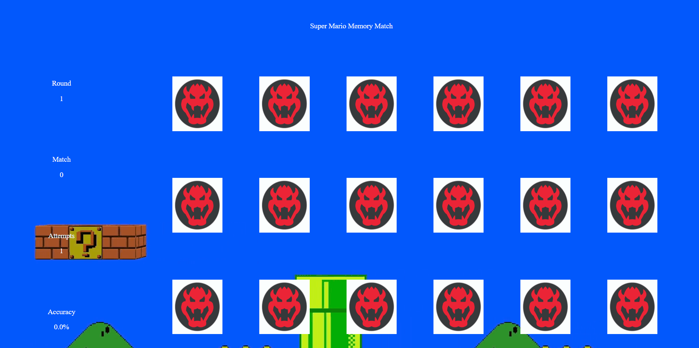

# Memory Match

> Maintained by: `Peter Han - peterjhan88`

## Summary
A JavaScript project which allows a user to enjoy a memory match game themed in Super Mario

## Live Demo


## See It in Live
[Link To Super Mario Match](https://super-mario-match.peterjhan.com)

## Features
- Users flip cards to see gifs they can potentially match
- Users can play multiple games
- Users can keep track of stats through the sidebar

## Future Features
- Mario/Other will encounter random enemy
- Mario/Other should match certain actions to defeat enemy
- Special effect sounds

## Try on Local Computer
1. Clone this repository on to your local computer
```

git clone https://github.com/peterjhan88/super-mario-match

```
1. Move to cloned folder
```

cd super-mario-match

```
1. Right click and open the index.html file in your default browser
1. Play

